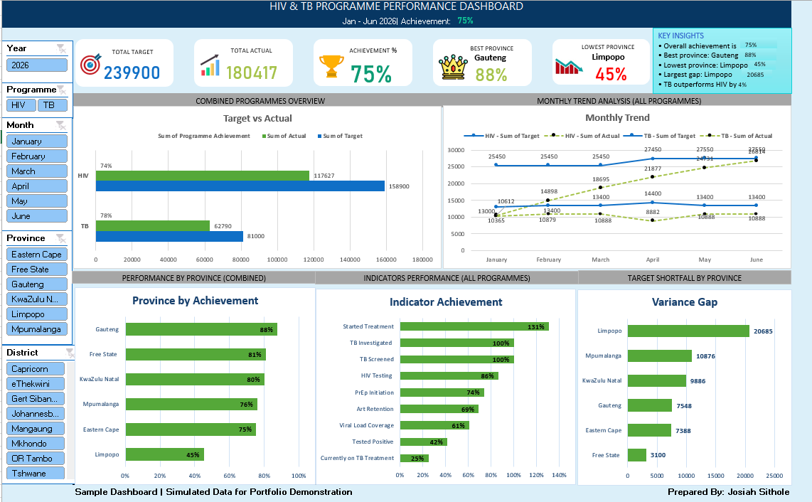

# HIV & TB Programme Performance Dashboard

## 📊 Project Overview

An interactive Excel dashboard developed to analyse simulated HIV and TB programme performance from January to June 2026.

The dashboard provides a management-level view of programme achievement, provincial performance, monthly trends, indicator performance, and target shortfalls.

> **Note:** This project uses simulated data and is intended for portfolio demonstration purposes only.

---

## 💼 Business Problem

HIV and TB programme managers require timely visibility into programme performance across provinces, districts, and key indicators to monitor progress against targets and identify areas requiring further attention.

The challenge is to transform programme data into a clear and interactive reporting tool that allows management to quickly understand performance, identify gaps, and monitor progress over time.

---

## 🎯 Project Objectives

The dashboard was developed to:

* Monitor programme targets against actual achievements
* Measure overall programme achievement
* Compare performance across provinces
* Analyse monthly programme trends
* Evaluate performance across key programme indicators
* Identify provinces with significant target shortfalls
* Provide an interactive reporting tool for management-level analysis

---

## 🛠️ Tools & Techniques

* Microsoft Excel
* Pivot Tables
* Pivot Charts
* Excel Slicers
* Excel Formulas
* Data Transformation
* Data Analysis
* Dashboard Design
* KPI Development
* Target vs Actual Analysis

---

## 📈 Dashboard Features

### Key Performance Indicators

* Total Target
* Total Actual
* Overall Achievement %
* Highest Achievement Province
* Lowest Achievement Province

### Analysis

* Target vs Actual performance
* Monthly programme trends
* Province-level achievement
* Indicator achievement
* Target shortfall by province

### Interactive Filters

Users can filter the dashboard by:

* Year
* Programme
* Month
* Province
* District

---

## 🔍 Key Insights

Based on the simulated dataset, the dashboard highlights differences in programme performance across provinces and indicators.

The analysis can be used to identify:

* Areas performing above or below programme targets
* Provinces with larger achievement gaps
* Indicators requiring closer monitoring
* Monthly changes in programme performance

---

## 📷 Dashboard Preview

---

## 📂 Project Files

| File                                | Description                 |
| ----------------------------------- | --------------------------- |
| `HIV_TB_Performance_Dashboard.xlsx` | Interactive Excel dashboard |
| `Dashboard_Screenshot.png`          | Dashboard preview           |
| `README.md`                         | Project documentation       |

---

## 📚 Lessons Learned

### 1. Data Visualization Is More Than Creating Charts

A dashboard should answer business questions rather than simply display data.

The project highlighted the importance of using visualisations to communicate:

* Achievement against targets
* Provincial performance
* Performance gaps
* Monthly trends
* Indicator-level performance

**Lesson:** Effective dashboards should tell a clear story and support decision-making.

### 2. KPI Design Matters

The initial version contained much of the same information as the improved version, but the information was more difficult to consume.

Introducing KPI cards and improving the visual hierarchy made the most important metrics easier to identify.

**Lesson:** The way information is presented is just as important as the information itself.

### 3. Simplicity Improves Readability

Adding too many colours, labels, and visual effects can make a dashboard difficult to interpret.

Simplifying the visuals helped improve readability and allowed the most important information to stand out.

**Lesson:** Less is often more when designing dashboards.

---

## 📌 Data Disclaimer

This project contains simulated data created for portfolio and demonstration purposes.

It does not represent actual HIV or TB programme performance or real patient information.

